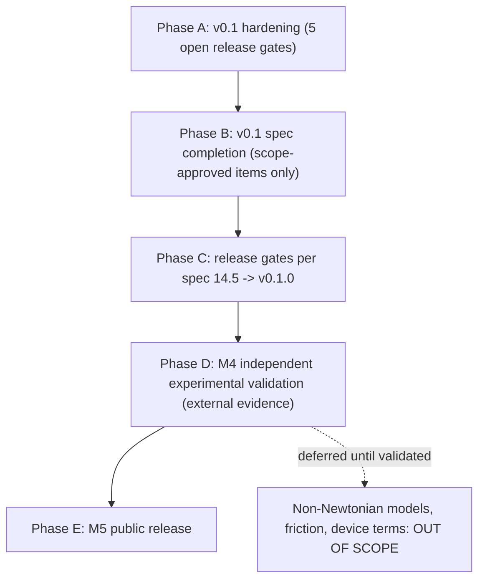

# OpenInjectability: full project plan

**Prepared:** 2026-08-01
**Baseline:** v0.1.0 alpha (commit `0add542`), 21 tests passing, 87% branch coverage
**Governance sources:** [PROJECT_GOAL.md](PROJECT_GOAL.md), [HANDOFF.md](HANDOFF.md), [PROJECT_SPECIFICATION.md](PROJECT_SPECIFICATION.md), [VALIDATION.md](VALIDATION.md)

## Grounding (verified 2026-08-01)

- Baseline: v0.1.0 alpha, 21 tests pass, 87% branch coverage, Ruff clean, package builds.
- `mypy --strict src` currently fails: 9 errors in [src/openinjectability/reporting.py](src/openinjectability/reporting.py) (lines 39, 123-126, 152), [src/openinjectability/plotting.py](src/openinjectability/plotting.py) (lines 34, 36), [src/openinjectability/cli.py](src/openinjectability/cli.py) (line 66).
- Governance: the result is always **predicted fluid-resistance force**, never total device force; non-Newtonian inputs fail closed; no scientific broadening during hardening.

## Phase flow

## Phase A — v0.1 hardening (immediate evidence-gated objective)

Implements the three fail-closed defects from [HANDOFF.md](HANDOFF.md) with regression tests each, then reconciles validation evidence and CI gates.

### A1. Gate 1 — sensitivity preserves the flow/time contract
- Defect: [_sensitivity](src/openinjectability/core.py) (`core.py:150-185`) perturbs `injection_time_s` via `dataclasses.replace` while a supplied `flow_rate_ml_s` stays stale, producing a scientifically inconsistent case; it also calls `_calculate` directly instead of the validated path the spec requires ("rerun the same validated scientific core").
- Fix: when perturbing the rate field, null the companion field (`flow_rate_ml_s=None` when perturbing time, and vice versa) and compute each perturbed force through the validated assess path; add a sensitivity case for `flow_rate_ml_s`-driven inputs.
- Regression tests in [tests/test_core.py](tests/test_core.py): both-fields-supplied case stays consistent for every perturbation; numerical sensitivity matches analytical elasticities (+1 viscosity, +1 length, +2 barrel ID, -4 needle ID, -1 time at fixed volume) per spec 8.1.

### A2. Gate 2 — malformed typed/provenance values fail closed with stable domain errors
- Defects in [src/openinjectability/models.py](src/openinjectability/models.py) and [src/openinjectability/core.py](src/openinjectability/core.py): `viscosity_value=True` silently coerces (bool is an int; `math.isfinite(True)` passes); a string number raises raw `TypeError`; non-string provenance raises raw `AttributeError` from `.strip()`; `viscosity_unit` Literal is unenforced at runtime.
- Fix: add construction-time runtime-type validation via `AssessmentInput.__post_init__` (frozen dataclass, spec 10: "models are typed and validate on construction"): reject `bool`, require `int`/`float` real numbers for numeric fields, require `str` for text/provenance fields, reject non-finite values — all raising `InputValidationError` with field-named messages. Sign/consistency/scientific-boundary checks stay in `core._validate` so existing boundary tests keep passing.
- Regression tests: bool coercion, string numerics, NaN/inf, non-string `newtonian_evidence`/`needle_geometry_source`, bad `viscosity_unit` each yield `InputValidationError`, never raw `TypeError`/`AttributeError`; engine batch records them as typed `RejectedAssessment` rows (they subclass `OpenInjectabilityError`, so [engine.py:104](src/openinjectability/engine.py) already captures them).

### A3. Gate 3 — batch rejects duplicate scenario identifiers
- Defect: [OpenInjectabilityEngine.assess_batch](src/openinjectability/engine.py) (`engine.py:90-113`) never checks cross-case duplicates; only the CSV adapter does ([io.py:36-42](src/openinjectability/io.py)).
- Fix: track seen `scenario_id` values in `assess_batch`; a duplicate becomes an explicit `RejectedAssessment` (`error_type="InputValidationError"`, stable message `duplicate scenario_id: '<id>'`) without dropping later cases, mirroring the CSV policy "duplicate or empty scenario_id is a hard error" (spec 7.1).
- Regression test in [tests/test_engine.py](tests/test_engine.py): duplicate IDs rejected in order, accepted-row order preserved.

### A4. Gate 4 — VALIDATION.md claims map to inspectable fixtures and tests
- Add `tests/reference_data/reference_case.json`: a hand-calculated, independently recomputed Newtonian reference case (inputs + expected pressure, force, shear rate, Reynolds) plus a loader test comparing the engine to fixture values.
- Add an explicit equivalence test for the simplified form `F = 32 u L Q D_b^2 / d^4` versus the pressure-area path (spec 5.4), and extend the unit-equivalence test to `mPa_s`.
- Rewrite [VALIDATION.md](VALIDATION.md) as a claims-to-evidence map: each claim (hand-calculated reference, equation equivalence, unit conversion, scaling, fail-closed behavior, CLI/report smoke, engine side-effect freedom) names the exact fixture file and test function that backs it.

### A5. Gate 5 — strict typing and Python 3.10-3.13 become enforced gates
- Fix the 9 `mypy --strict` errors: narrow `float | None` outputs before arithmetic in `reporting.py:39/152` and `plotting.py:34/36`; annotate the payload dict in `cli.py:66`; silence untyped reportlab imports via an override (reportlab ships no stubs).
- Add `[tool.mypy]` strict config to [pyproject.toml](pyproject.toml) including `[[tool.mypy.overrides]] module = "reportlab.*", ignore_missing_imports = true`.
- Upgrade [.github/workflows/quality.yml](.github/workflows/quality.yml): Python matrix 3.10/3.11/3.12/3.13; steps for `pytest --cov=openinjectability --cov-branch`, `ruff check src tests`, `mypy --strict src`, `python -m build`, and an installed-wheel smoke (fresh venv, `pip install dist/*.whl`, `openinjectability --version`, example assessment, import outside the source tree).

**Phase A exit:** all five HANDOFF gates closed; verification commands in HANDOFF.md pass locally and in CI on the full matrix.

## Phase B — v0.1 spec completion (only after Phase A; each item scope-approved)

Items in [PROJECT_SPECIFICATION.md](PROJECT_SPECIFICATION.md) v0.1 scope but not yet implemented, in dependency order:
- Run-level `--config` YAML/JSON loading with serialized effective configuration (spec 6.4).
- Inverse calculation: user-supplied provenance-backed `force_ceiling_n` yields `Q_max` / `t_min` labeled as model-derived screening quantities (spec 5.7); never ship a default ceiling.
- Multi-step sensitivity from config `relative_changes` list (spec 6.4) replacing the single `sensitivity_relative_change`.
- Remaining warning codes with stable machine-readable payloads (spec 7.2): geometry-tolerance absent, shear rate outside evidence range, gauge/geometry inconsistency, component-rating exceedance.
- CLI completion (spec 11): `assess-one`, `compare-geometries`, `schema`, `version` subcommands and documented exit codes 0/2/3/4/5.
- `--audit-bundle` ZIP with deterministic entries and `manifest.sha256` (spec 12.3).
- Docs: `docs/scientific-basis.md`, `docs/input-schema.md`, `docs/interpretation.md`, `docs/roadmap.md`, plus `CHANGELOG.md` and `CITATION.cff`.

## Phase C — release gates -> v0.1.0 (spec 14.5)

- Version agreement across package, CLI, reports, and validation registry.
- Full test suite, Ruff, `mypy --strict`, build + metadata validation all green on the 3.10-3.13 matrix.
- Clean-environment wheel install; CLI smoke generates JSON, Markdown, HTML, PDF, and plots from the reference fixture; PDF pages visually inspected.
- Validation registry ships inside the wheel (already configured via package-data; verify in the installed artifact).
- Language audit: no "total injection force", "safe", "compliant", or human-capability claims anywhere in docs, reports, or CLI output; disclaimer and exclusions sit beside every force result.

## Phase D — M4 independent experimental validation (external evidence gate)

- Lock a validation protocol with predefined comparison metrics and acceptance criteria before seeing validation data (spec 14.4).
- Obtain/generate an independently traceable Newtonian dataset (viscosity, temperature, measured needle ID/length, barrel ID, volume, rate, measured fluid force or pressure); keep development data separate.
- Reproduce without hidden correction factors; publish permitted fixtures + hashed validation report.
- Only then may `validation_status` move beyond `internal_validation; experimental_validation_pending` — never to `independently_validated` without the published record.

## Phase E — M5 public release

- Tagged, signed release; wheel + sdist published; documentation site/README finalized; fresh public-index install verified.

## Guardrails (apply to every phase)

- Result is always named **predicted fluid-resistance force**; the exclusions list travels with every result.
- Non-Newtonian rheology, friction/break-loose, device/tissue terms, probabilistic stacks, and web hosting stay deferred until their own independent validation (spec 18).
- No silent data repair; every rejection is a typed, stable, machine-readable record.
- Every phase lands with regression tests first; coverage stays at or above the current 87% branch baseline.

## Work tracker

- [x] **A1** sensitivity preserves the flow/time contract + elasticity regression tests
- [x] **A2** construction-time runtime-type validation with stable domain errors + regression tests
- [x] **A3** batch duplicate scenario_id rejection + regression test
- [x] **A4** reference_data fixture, simplified-equation equivalence test, VALIDATION.md claims-to-evidence map
- [x] **A5** mypy --strict clean, typing config, CI matrix 3.10-3.13 with enforced gates and wheel smoke
- [x] **B** v0.1 spec completion (config file, inverse calculation, multi-step sensitivity, warning codes, CLI completion, audit bundle, docs)
- [x] **C** spec 14.5 release gates for v0.1.0
- [~] **D** literature panel from Allmendinger 2014 (digitized Fig. 3A + Table 1); experimental_comparison pass; not independently_validated
- [~] **E** public release — blocked on D + publish credentials; annotated tag v0.1.0 present
